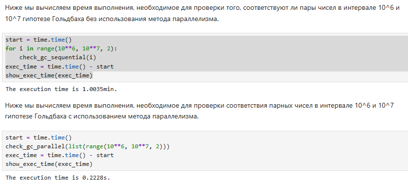
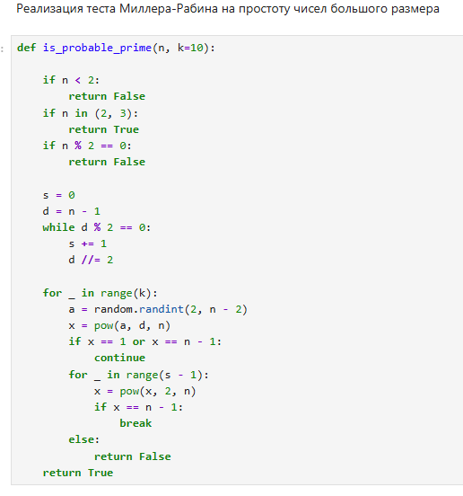
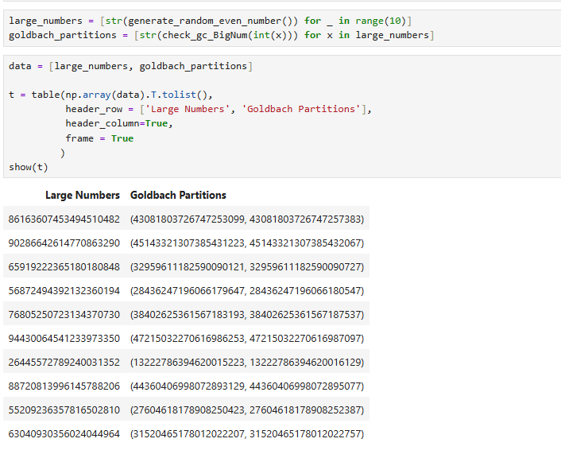
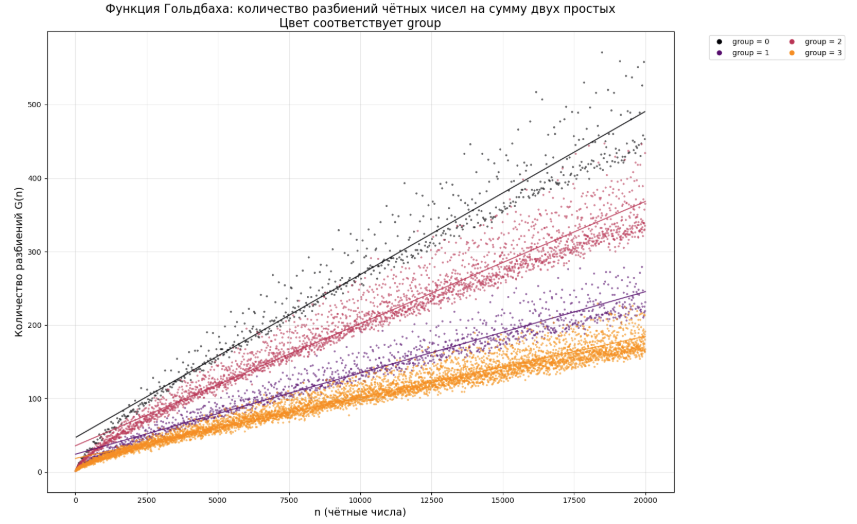
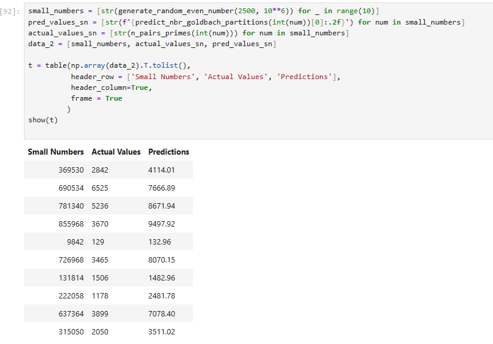
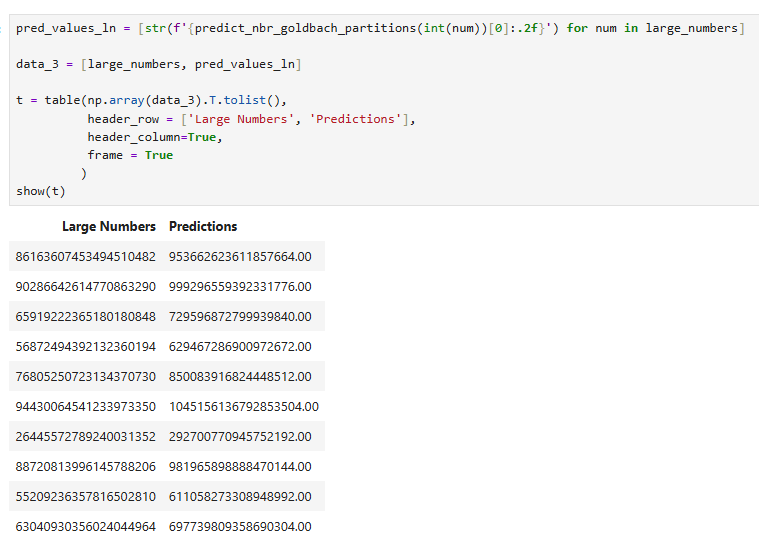

# research_work
This repository contains the program I implemented during my research scientific work.

# Instructions
This program needs to be run on the software SageMath. You will need to install also some libraries like matplotlib, and numpy.

# Installation
If SageMath is not installed already in your computer, you can do it by following the instructions in this link by clicking [here](https://doc.sagemath.org/html/en/installation/index.html).

# Description of the program
- The program aim at finding a counter example to the goldbach conjecture, which means finding one even number that can't be expressed as the sum of two prime numbers.

- At first, we try to verify if the even numbers in the range 106 to 107 satisfy the goldbach conjecture and then we try to optimize that verification by using the @parallel decorator of SageMath.
  
  
- Then, we implement the Miller-Rabin primality test to check if it's probable for a given number to be considered as prime.

  

- After, we generate randomly some large numbers and attempt to find for each of them one goldbach partition.
  
  
- We plot a graph to represent the number of goldbach partitions for all even numbers in the range of 4 to 20000. And we train a simple linear regression model to predict the number of goldbach partitions.
  

- We then try to predict the number of goldbach partitions for small numbers and compare it with their actual number of goldbach partitions.
  

  
- We then predict for large numbers their number of goldbach partitions.
  
